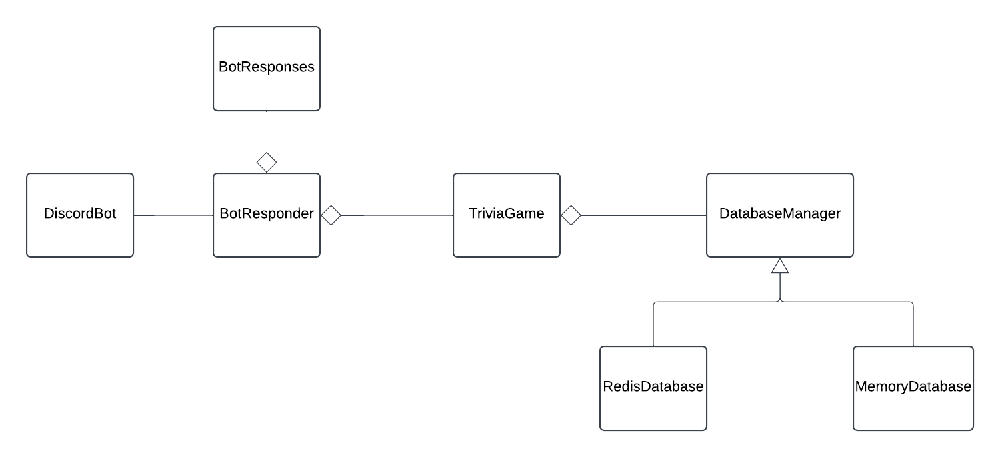

# NBA Discord Bot  

Nba Discord Bot is a program that asks users various questions about the NBA. 
In this program, the discord bot will take commands of a user to start a game, game status, users in game, and end game.
The bot will then use the core application to gather scores for each user and display the winner at the end of the game.

---

## Features  
- **NBA Trivia**: Players can answer questions about NBA history, stats, and players.  
- **Redis Integration**: Stores player scores and game data efficiently.  
- **Multiplayer Support**: Two players compete while others can spectate.  

---

## Prerequisites  

### Install Dependencies  
- Java (ensure you have Java 17 or later)  
- Redis (for storing game data)  
- Maven (for dependency management)  

### Create a Discord Bot  
1. Go to the [Discord Developer Portal](https://discord.com/developers/applications)  
2. Click **New Application** and name it.  
3. Navigate to **Bot**, then click **Add Bot**.
4. Under **Token** click **Reset Token**. 
5. Copy the **Bot Token** and add it to to a `.env` file in the root of the **NbaDiscordBot** directory.
6. Content of the `env` file should be DISCORD_TOKEN=<**paste Token here**>
7. Find **Privileged Gateway Tab**, Enable `Presence Intent` and `Message Content Intent`.
8. Click on the **OAuth2** section in the menu on the left.
9. In the **Scopes** section, select the checkbox for `bot`.
10 .In `Bot Permissions` under `Text Permissions`, click the checkbox for `Send Messages`.
11. At the bottom under **Generated URL** click copy.”
12. Paste the URL into a new browser tab.
13. When the page loads, under “Add to Server” select your **discord server**.
14. Authorize the bot, and then close the tab.
---

## Installation  

### 1. Clone the Repository  
```sh
git clone https://github.com/AJamell/NBADiscordBot.git
cd NBADiscordBot
```

## System Diagram



`For my database i have a interface that will be implemented by a redisdatabase or a inmemorydatabase. 
These databases will store questions, answers, choices, players and scores and also checks if a user answer matches a correct answer.
My trivia class is my core application which contains start game, in progress, reset,adding score,adding a player, and handling a answer.
My botresponder has a trivia game and uses trivia class to start a game, check status, add player and end game.
My bot responses will provide the user with prompts and responses to the commands they input and will be used in botresponder for exception handling.
Finally, my discord bot will then take the user input and send it to the botresponder to get the response and send it back to the user.`


## Usage

`User Commands:`

`!start - start a new trivia game.` 

`!join - executed by any user who wants to join the game.`

`!go - used to move the game from STARTING to IN_PROGRESS.`

`!status - get the status of the game.`

`!info - get information about the game.`

`!quit - places the game in the NO_GAME state `

`!help - list the commands of the game.`

## License  
This project is intended for **educational purposes only** as part of a school project.  
It is not licensed for commercial or public use.  


